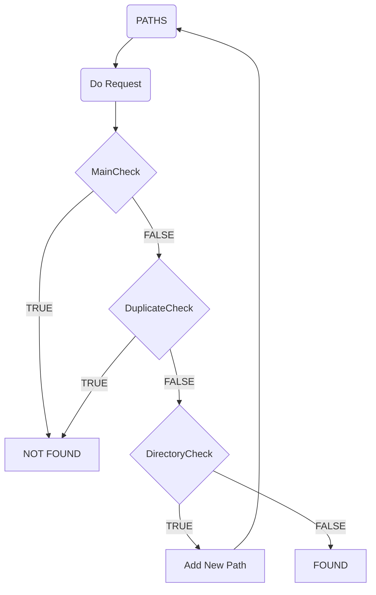

# URL Fuzzing Tool

This project is a URL fuzzing tool that helps to discover hidden paths and resources on a target web application. It supports multithreading, custom HTTP headers, and customizable request parameters to optimize fuzzing performance.

The tool uses the similarity algorithm from [hyperjumptech/beda](https://github.com/hyperjumptech/beda) to evaluate if the results are valid or false positives during the fuzzing process.


## Features

- **Detects potential false positives using a similarity algorithm:** 
  During the fuzzing process, the tool analyzes the responses returned by the server and compares them with a baseline response (usually a 404 or 429 response indicating "Not Found" or "Too Many Requests"). The comparison is done using the Jaro and Jaro-Winkler distance algorithms from the [hyperjumptech/beda](https://github.com/hyperjumptech/beda) repository.

  The tool checks if two responses are similar by comparing the response body of the baseline with the current response. If the Jaro distance is greater than 0.80 and the Jaro-Winkler distance is greater than 0.90, the responses are considered similar, and the current response is marked as a potential false positive. This helps to avoid reporting irrelevant results, such as repeated "Not Found" pages, by filtering out responses that match the structure and content of a 404 error page or similar responses.

  Additionally, the tool handles duplicate responses by tracking a list of previously encountered responses. If a new response matches one already seen, the tool increases the duplicate counter. Once the duplicate counter reaches a threshold, the response is considered a duplicate and ignored.
- **Automatic URL Extraction without Matchers or Filters**:  
  Unlike other fuzzing tools that require complex matcher or filter commands to refine the results, this tool automatically extracts valid URLs with a single command. It uses an intelligent similarity algorithm to detect false positives, eliminating the need to manually configure matchers or filters. 

  By analyzing the response structure and comparing it with common patterns such as 404 or 429 errors, the tool can determine whether a response is valid or a false positive. This makes it highly efficient, allowing users to extract hidden URLs directly without additional configuration. Simply provide the target URL and wordlist, and the tool will handle the rest, filtering out irrelevant responses and providing you with valid results.
- URL fuzzing with custom wordlists
- Customizable request method (currently supports only `GET`)
- Ability to add custom headers
- Multi-threading support for faster fuzzing
- Silent mode for quiet output
- Custom timeouts for failure and response handling
- Adjustable depth for fuzzing subdirectories

## Installation
To install and use the tool, you can install from go install 

```bash
 go install github.com/Serhatcck/hidden_fuzzer@latest
```


To install and use the tool as a module, you can include it in your project from the following repository:

```bash
go get github.com/Serhatcck/hidden_fuzzer
```

## Usage
The tool can be run from the command line with the following options:
```bash
Usage: hidden_fuzzer [options]

Options:
  -h                     Show the help message
  -url string            Target URL
  -w string              Wordlist file
  -e string              Extensions (e.g., ".json"). For multiple extensions, use commas.
  -H "Name: Value"       Custom headers. For multiple headers, pass multiple `-H` options.
  -m string              Request method (currently only supports GET)
  -t int                 Maximum number of threads (default: 50)
  -fail-counter int      Number of allowed failures before stopping (default: 3)
  -dp-counter int        Number of duplicate responses before stopping (default: 50)
  -rd-counter int        Number of allowed redirects before stopping (default: 3)
  -silent                Run in silent mode
  -fc-tm-out int         Failure check timeout in seconds (default: 1)
  -tm-out int            HTTP response timeout in seconds (default: 20)
  -depth int             Maximum subdirectory depth to fuzz (default: 3)
```


## Example
Fuzzing a target URL with a custom wordlist and headers:
```bash
hidden_fuzzer -url http://example.com -w wordlist.txt -H "Authorization: Bearer token" -e ".php,.html" -t 100
```
This command fuzzes the target http://example.com using the specified wordlist and headers, searching for .php and .html files with 100 threads.

## Module Usage

You can use this tool as a module in your Go project. Import it as follows:
```go
import "github.com/Serhatcck/hidden_fuzzer"

```
## Workflow Diagram



### Acknowledgments

Special thanks to the following repositories for their inspiration and contributions:

- [ffuf](https://github.com/ffuf/ffuf) for providing inspiration on how to structure and optimize the fuzzing process.
- [hyperjumptech/beda](https://github.com/hyperjumptech/beda) for the similarity algorithm used in detecting false positives.
